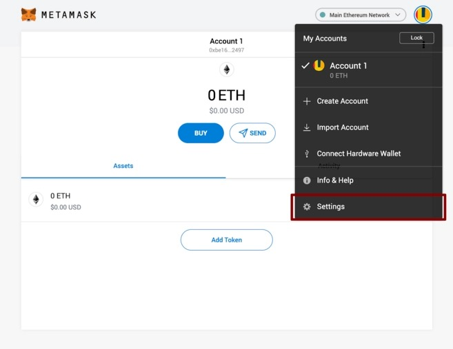

# Sidechain MetaMask Setup

Configuring the Sidechain MetaMask is quick and striaghtforward.

## Setup

Change the settings to point the wallet towards Upstreet Sidechain nodes.

1. Select **`Settings`** from the dropdown menu.

2. On the Settings page, locate the **`Networks`** menu.

Click **`Add Network`** in the top-right corner to manually add the Upstreet Side Chain.

**`Network Name`**: Upstreet Sidechain

**`New RPC URL`**: https://ethereum1.upstreet.ai/

**`ChainID`**: 1338

**`Symbol`**: SILK

---
